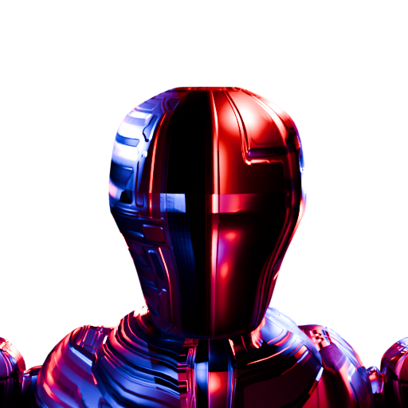

[![Contributors][contributors-shield]][contributors-url]
[![Forks][forks-shield]][forks-url]
[![Stargazers][stars-shield]][stars-url]
[![Issues][issues-shield]][issues-url]
[![Steam][steam-shield]][steam-url]
[![LinkedIn][linkedin-shield]][linkedin-url]

<br />
<div align="center">

<a href="https://github.com/josephHelfenbein/rind">
    
  </a>

<h3 align="center">Rind</h3>

  <p align="center">
    An open-source first-person shooter and the custom Vulkan engine it runs on. You fight waves of robots, and the difficulty gets harder the longer you stay alive.
    <br />
    <br />
    <a href="https://github.com/josephHelfenbein/rind/issues/new?labels=bug&template=bug-report---.md">Report Bug</a>
    ·
    <a href="https://github.com/josephHelfenbein/rind/issues/new?labels=enhancement&template=feature-request---.md">Request Feature</a>
  </p>
</div>


## The game


https://github.com/user-attachments/assets/09cfa877-60bb-400b-84dd-d5022e30a0c6


You play a robot with a laser gun, grenades, a melee punch, a dash, and a double jump. The laser gun overheats, so timing matters. Enemies arrive in waves: walking grunts, flying drones, and heavy bashers, plus four elite variants (flying, bashing, grenade-throwing, missile-firing). Kills can give a random status effect that buffs or debuffs the player, and the explosion left behind can heal the player. The score will keep climbing until you lose.

## The repository

The codebase is open so people can read it, contribute, mod the game, or build their own game on top of the engine. The Steam page is [here](https://store.steampowered.com/app/4412940/Rind/).

### Where to start

Pick the path that matches what you're here for:

| I want to...                            | Jump to |
| ------------------------------------- | ------- |
| **Build the game**            | [Prerequisites](#prerequisites), [Build Instructions](#build-instructions) |
| **Understand how it works**           | [The game](#the-game), [Game code](#game-code), [Engine overview](#engine-overview), [Rendering pipeline](#rendering-pipeline) |
| **Mod the game**                      | [Modding the game](#modding-the-game) |
| **Build my own game on the engine**   | [Submodule guide](#using-rind_engine-as-a-submodule), [Asset pipeline](#asset-pipeline) |
| **Report a bug**              | [Reporting bugs](#reporting-bugs) |
| **Contribute**                | [Contributing](#contributing) |

### Built With

* [![C++][C++]][C++-url]
* [![Vulkan][Vulkan]][Vulkan-url]
* [![ISPC][ISPC]][ISPC-url]

## Prerequisites

### General
- **CMake** 3.21+
- **Vulkan SDK** 1.3+ (must support Dynamic Rendering)
- **C++20** compatible compiler
- **DXC** (DirectX Shader Compiler), usually included with the Vulkan SDK
- **ISPC** 1.20+ ([Intel SPMD Program Compiler](https://github.com/ispc/ispc))

---

### Windows

1. Install [Visual Studio 2022](https://visualstudio.microsoft.com/) with the **"Desktop development with C++"** workload selected. This provides MSVC, CMake, and the Windows SDK.
2. Install **Ninja** and put it on your PATH (`winget install Ninja-build.Ninja`, `scoop install ninja`, or download from the [Ninja releases](https://github.com/ninja-build/ninja/releases)).
3. Install the [LunarG Vulkan SDK](https://vulkan.lunarg.com/sdk/home#windows). This includes `dxc.exe` and sets up `VULKAN_SDK` in your environment automatically.
4. Verify `dxc.exe` is accessible. It should be on your PATH after the SDK install. If not, add `%VULKAN_SDK%\Bin` to your PATH manually.
5. Install **ISPC**. Download the latest Windows `.zip` from the [ISPC GitHub releases](https://github.com/ispc/ispc/releases), extract it somewhere stable, and add the extracted `bin\` directory to your PATH so `ispc.exe` is discoverable. Alternatively `scoop install main/ispc` if you use [Scoop](https://scoop.sh/).

---

### macOS

macOS requires MoltenVK to run Vulkan on Metal. You can get all dependencies either via the **LunarG Vulkan SDK** (recommended, includes DXC) or via **Homebrew** with a separate DXC install.

**1. Install Xcode Command Line Tools**
```bash
xcode-select --install
```

**2. Install Homebrew** (if not already installed)
```bash
/bin/bash -c "$(curl -fsSL https://raw.githubusercontent.com/Homebrew/install/HEAD/install.sh)"
```

**3. Install dependencies**
```bash
brew install cmake glfw freetype molten-vk vulkan-loader vulkan-headers ispc
```

- `molten-vk` - Vulkan implementation on top of Metal (required on macOS)
- `vulkan-loader` - Vulkan loader library (`libvulkan`)
- `vulkan-headers` - Vulkan header files
- `glfw` - windowing library
- `freetype` - font rendering library
- `ispc` - Intel SPMD Program Compiler, used to build the engine's SIMD kernels

**4. Install DXC (DirectX Shader Compiler)**

DXC is not in Homebrew core. Choose one of:

- **Option A, LunarG Vulkan SDK (recommended):** Download and run the installer from [vulkan.lunarg.com](https://vulkan.lunarg.com/sdk/home#mac). The SDK bundles DXC and sets `VULKAN_SDK` automatically, which CMake will pick up. If you use this, you can skip `molten-vk`, `vulkan-loader`, and `vulkan-headers` from the Homebrew step above.

- **Option B, Homebrew tap:**
  ```bash
  brew tap SharkyRawr/dxc
  brew install SharkyRawr/dxc/directx-shader-compiler
  ```

---

### Linux: Ubuntu

For Ubuntu 24.04 (Noble) or Ubuntu 22.04 (Jammy).

**1. Install build tools and dependencies**
```bash
sudo apt install \
  build-essential cmake git \
  libvulkan-dev \
  libglfw3-dev \
  libx11-dev libxrandr-dev libxinerama-dev libxcursor-dev libxi-dev \
  ispc
```

For **Ubuntu 24.04 (Noble)**:
```bash
sudo apt install libfreetype-dev
```

For **Ubuntu 22.04 (Jammy)**:
```bash
sudo apt install libfreetype6-dev
```

> If your distro's `ispc` package is older than 1.20 (Ubuntu 22.04 ships an older release), grab a current Linux tarball from the [ISPC GitHub releases](https://github.com/ispc/ispc/releases), extract, and either put the extracted `bin/ispc` on your `PATH` or `sudo cp bin/ispc /usr/local/bin/ispc`.

**2. Install Zig** (default Linux compiler)

Targets an older `glibc` with Zig so the binary runs under the Steam Linux Runtime and Steam Deck. Pass `-DRIND_USE_ZIG=OFF` for the system compiler instead.

```bash
sudo snap install zig --classic --beta   # or download from ziglang.org/download
```

**3. Install DXC via LunarG apt repo**

DXC is not in Ubuntu's standard repositories. Install it from the LunarG apt repo:

For **Ubuntu 24.04 (Noble)**:
```bash
wget -qO- https://packages.lunarg.com/lunarg-signing-key-pub.asc \
  | sudo tee /etc/apt/trusted.gpg.d/lunarg.asc
sudo wget -qO /etc/apt/sources.list.d/lunarg-vulkan-noble.list \
  https://packages.lunarg.com/vulkan/lunarg-vulkan-noble.list
sudo apt update
sudo apt install dxc
```

For **Ubuntu 22.04 (Jammy)**, replace `noble` with `jammy` in both URLs above.

> Alternatively, download the full [LunarG Linux tarball](https://vulkan.lunarg.com/sdk/home#linux) which bundles DXC alongside the entire Vulkan SDK and sets up `VULKAN_SDK` for you.

---

### Linux: Debian

For Debian 12 (Bookworm).

**1. Install build tools and dependencies**
```bash
sudo apt install \
  build-essential cmake git \
  libvulkan-dev \
  libglfw3-dev \
  libfreetype6-dev \
  libx11-dev libxrandr-dev libxinerama-dev libxcursor-dev libxi-dev
```

> Debian stable has no `ispc` package. Download the Linux tarball from the [ISPC GitHub releases](https://github.com/ispc/ispc/releases), extract, and `sudo cp bin/ispc /usr/local/bin/ispc`.

**2. Install Zig**

Targets an older `glibc` with Zig so the binary runs under the Steam Linux Runtime and Steam Deck. Pass `-DRIND_USE_ZIG=OFF` for the system compiler instead.

```bash
sudo snap install zig --classic --beta   # or download from ziglang.org/download
```

**3. Install DXC**

There is no LunarG apt repo for Debian. Download the pre-built DXC binary from the [DXC GitHub releases](https://github.com/microsoft/DirectXShaderCompiler/releases):

```bash
# Replace the filename with the latest release version
wget https://github.com/microsoft/DirectXShaderCompiler/releases/download/v1.9.2602/linux_dxc_2026_02_20.x86_64.tar.gz
tar -xf linux_dxc_*.x86_64.tar.gz
sudo cp bin/dxc /usr/local/bin/dxc
sudo chmod +x /usr/local/bin/dxc
```

> Alternatively, download the full [LunarG Linux tarball](https://vulkan.lunarg.com/sdk/home#linux) which bundles DXC with the full Vulkan SDK.

---

### Linux: Arch

**1. Install all dependencies**
```bash
sudo pacman -S \
  base-devel cmake git \
  vulkan-headers vulkan-icd-loader \
  glfw \
  freetype2 \
  directx-shader-compiler \
  ispc \
  zig
```

- `vulkan-icd-loader` - Vulkan loader (runtime). You also need a Vulkan ICD driver for your GPU:
  - NVIDIA: `nvidia-utils`
  - AMD: `vulkan-radeon` (RADV, open-source) or `amdvlk`
  - Intel: `vulkan-intel`
- `glfw` - provides both X11 and Wayland support
- `freetype2` - font rendering library
- `directx-shader-compiler` - DXC, available in the official `extra` repo
- `ispc` - Intel SPMD Program Compiler for the engine's SIMD kernels
- `zig` - default Linux compiler (`zig cc`); targets an older `glibc` so the binary runs under the Steam Linux Runtime and Steam Deck. Pass `-DRIND_USE_ZIG=OFF` to use the system compiler.

> You may also want `vulkan-validation-layers` for debugging.

---

## Build Instructions

### 1. Clone the repository
```bash
git clone --recursive https://github.com/josephHelfenbein/rind.git
cd rind
```

If already cloned, run
```bash
cd rind
git submodule update --init --recursive
```

### 2. Configure

```bash
cmake -S . -B build -DCMAKE_BUILD_TYPE=Release
```

On **Windows**, configure with the Ninja generator (required for ISPC support):

```powershell
cmake -S . -B build -G Ninja -DCMAKE_BUILD_TYPE=Release
```

### 3. Build

```bash
cmake --build build --parallel
```

### 4. Run

The executable will be located in the `bin` directory.

**Windows:**
```powershell
.\bin\Rind.exe
```

> Log output is not visible for Windows Release builds. Build with `-DCMAKE_BUILD_TYPE=Debug` to get a console with logs.

**macOS / Linux:**
```bash
./bin/Rind
```

### Building with Steam support

Steam integration (leaderboards) is optional and off by default, gated behind the `RIND_ENABLE_STEAM` flag. With the flag off, the Steam code compiles to empty no-op stubs and no Steamworks header, library, or runtime is referenced or linked.

#### Enabling the build flag

The Steamworks SDK is proprietary and is **not bundled with this repository**. Download it yourself from the [Steamworks partner site](https://partner.steamgames.com/downloads/list), unzip it somewhere stable, then configure pointing `STEAMWORKS_ROOT` at the SDK root (the directory containing `public/` and `redistributable_bin/`):

```bash
cmake -S . -B build -DCMAKE_BUILD_TYPE=Release \
  -DRIND_ENABLE_STEAM=ON -DSTEAMWORKS_ROOT=/path/to/sdk
```

CMake links the platform-appropriate redistributable and copies the runtime library next to the binary and into the packaged build. The Steamworks SDK itself is not redistributed in this Apache-2.0 repository; only your own local copy is used at build time.

#### How leaderboard submission works (server-authoritative)

The leaderboard uses Steam **Trusted writes**: the game never writes scores directly. On run start and on death it `POST`s to a backend you host, which holds the Steam publisher Web API key, verifies the player's Steam Web API auth ticket, validates the run, and writes the score via the Steam Web API. The backend is not part of this repository.

The backend URL is compiled in at configure time (`-DRIND_LEADERBOARD_URL=https://your-server/submit`, https only, kept out of the repo); without it, submission is a no-op. An optional `-DRIND_LEADERBOARD_TOKEN=...` adds an `X-App-Token` header.

## Packaging

After a successful Release build, run the packaging script to produce a platform-native distributable:

```bash
cmake -P cmake/package.cmake
```

Output is written to a `dist/` folder in the project root. An optional version string can be passed:

```bash
cmake -DVERSION=1.2.0 -P cmake/package.cmake
```

The script auto-detects the OS it is running on and packages accordingly.

| Platform | Output |
|----------|--------|
| macOS    | `dist/Rind.app` |
| Linux    | `dist/Rind-<version>.AppImage` |
| Windows  | `dist/Rind-<version>-windows/` folder + `.zip` |

### macOS

No extra tools required. The `.app` bundle includes the bundled dylibs and Vulkan ICD and can be double-clicked or distributed as-is.

### Linux

Requires **Zig** and **appimagetool** on PATH.

The packaging script automatically rebuilds the project using `zig cc` to target glibc 2.36, so the resulting AppImage runs on older systems like the Steam Deck. The target glibc version and architecture can be overridden:

```bash
cmake -DZIG_GLIBC=2.38 -DRELEASE_MARCH=x86_64_v3 -P cmake/package.cmake
```

Zig uses underscored CPU names (e.g. `x86_64_v2`, `znver2`). Run `zig cc --print-supported-cpus` to see the full list.

Download `appimagetool` from [AppImageKit](https://github.com/AppImage/appimagetool/releases/tag/continuous):

```bash
chmod +x appimagetool-x86_64.AppImage
sudo mv appimagetool-x86_64.AppImage /usr/local/bin/appimagetool
```

### Windows

No extra tools required. A `.zip` of the distributable folder is created automatically using CMake's built-in archive support.

---

## Repository layout

- **`src/engine/`**, **`include/engine/`**: engine sources and headers, built as the `rind_engine` static library. Engine-owned shaders live in `src/engine/assets/shaders/hlsl/` and compile into the library.
- **`src/rind/`**: game sources, built as the `Rind` executable that links against `rind_engine`. Game headers live in `src/rind/include/rind/`; game-only shaders in `src/rind/assets/shaders/hlsl/`.
- **`src/assets/`**: game-owned non-shader assets (`models/`, `textures/`, `audio/`, `fonts/`). Embedded into the `Rind` executable and registered with the engine managers at startup via `registerEmbedded*()` calls in `GameInstance`.
- **`src/main.cpp`**: process entry point. Calls `engine::Platform::initialize()` then `runWithCrashReport(...)` with a lambda that constructs and runs `rind::GameInstance`.
- **`cmake/`**: `RindEngine.cmake` exports the build helpers (`embed_asset_category`, `rind_engine_compile_shaders`, `rind_engine_bundle_runtimes`); `embed_asset.py` and `generate_registry.py` are the worker scripts those helpers invoke; `package.cmake` builds release artifacts.
- **`include/external/`**: vendored third-party libraries, pulled in as submodules.

## Engine overview

*One central `Renderer` owns the GPU, and a set of focused managers (lights, particles, physics, audio, UI, etc.) each handle one job and route their work through it.*

The engine is a deferred PBR renderer built on Vulkan 1.3 with Dynamic Rendering. The renderer owns the shared GPU state; other managers request resources from it and submit work back through it. Headers are in `include/engine/` and sources in `src/engine/`.

- **Renderer**: Vulkan host. Owns the instance, device, queues, swapchain, command pools, descriptor allocators, and per-frame command recording.
- **ShaderManager**: Shader modules, render passes, and the render graph. Passes are `RenderNode`s organized into `RenderLane`s; async-capable lanes run on a separate compute queue in parallel with graphics. Default graph lanes: `GeneralGraphics`, `Volumetric`, `Shadow`, `IrradianceSH`, `IrradianceRender`.
- **LightManager**: Point lights with a baked shadow cubemap per light and a dynamic cubemap for moving lights (currently capped at 16).
- **IrradianceManager**: Irradiance probes with baked color cubemaps and dynamic cubemaps projected to spherical harmonics for indirect lighting (currently capped at 64). Runs on its own async lanes.
- **ParticleManager**: CPU-side particle pool with two types: physics particles (gravity, bounce off `AABB`/`OBB`/`ConvexHull` colliders, multithreaded via the engine thread pool) and static trail segments. Each particle keeps two prior positions so the renderer can fit a quadratic Bezier tangent for motion streaking. Live particles are packed into a per-frame host-coherent vertex buffer with camera-visible particles at the front; the buffer auto-grows up to a hard cap.
- **VolumetricManager**: Smoke, muzzle flash, and explosion volumes with lifetime easing.
- **EntityManager / SceneManager**: Hierarchical entity tree with transform inheritance, skeletal animation, and colliders. The per-frame update runs the transform/game-logic traverse serially (transform inheritance is depth-first; `update()` can have cross-entity side effects), then dispatches `updateAnimation` for all animated entities through the engine thread pool. `SceneManager` swaps between top-level scenes.
- **ModelManager**: glTF 2.0 loading via `fastgltf`, GPU buffers, skeleton and animation data.
- **TextureManager**: Image resources for materials, UI, render targets, and HDR environment maps. Init runs a two-phase load: CPU decode parallelized across the engine thread pool, then a serial Vulkan upload pass.
- **Collider / SpatialGrid**: AABB, OBB, and convex-hull SAT tests, broad-phased by a 3D hash grid. SpatialGrid queries return SoA candidate AABBs with a SIMD AABB-vs-AABB filter already applied. Callers iterate the survivors and run narrow-phase. Raycast paths run an additional SIMD ray-vs-AABB slab test before per-candidate narrow-phase. Convex-hull SAT projections also vectorize across hull verts.
- **AudioManager**: `miniaudio` wrapper with 3D spatialization and pitch variation.
- **InputManager**: GLFW keyboard, mouse, and gamepad input. Controller mode provides on-screen cursor navigation for menus.
- **UIManager**: 2D overlay with `FreeType` glyph caching and anchored widget layout.
- **Camera**: Perspective camera. Exposes the six frustum planes, and the actual per-frame entity cull lives in `EntityManager::renderEntities` which batches all visible-candidate AABBs through `simd::cullAABBsAgainstFrustum`.
- **SettingsManager**: Persistent video, audio, and input settings.
- **ThreadPool**: Persistent worker pool used for data-parallel hot paths like per-frame particle collision and animation passes, convex-hull world-space vertex transforms, and init-time texture decode. One worker per logical core minus one; the caller thread runs the first chunk, workers handle the rest, completion is a short spin-wait so chunked work doesn't pay a condvar wakeup.
- **SIMD module**: Wraps a small set of ISPC kernels (`src/engine/Kernels.ispc`) compiled into per-CPU-target variants with first-call CPUID dispatch built into ISPC. Used for batched frustum culling, AABB-vs-AABB and ray-vs-AABB broad-phase filtering, convex-hull SAT projection, and particle kinematics integration.

## Rendering pipeline

*Each frame is assembled in stages: fill the geometry buffers, light them, layer on effects (shadows, particles, volumetrics, reflections, bloom, etc.), then tonemap and draw the UI on top. The numbered list below is that order.*

The graph is described in `ShaderManager::createDefaultShaders`. One frame runs roughly in the order below; the lane name after each step matches the `RenderLane::name` it is assigned to in code, and async lanes run in parallel with the main `GeneralGraphics` lane on a separate compute queue.

1. **`gbuffer`** (`GeneralGraphics`): writes albedo, normal, depth, and material parameters for every renderable 3D entity.
2. **`ao`** (`GeneralGraphics`): depends on `gbuffer`. Tiled compute pass with three modes selected by the `aoMode` setting: off, SSAO (rotated sphere kernel), or GTAO (horizon-based). Writes a single-channel occlusion image consumed by `lighting`.
3. **`volumetric`** (`Volumetric`, async): depends on `gbuffer`. One ray-marched cube mesh per volume in the fragment shader, with curl-noise-warped FBM density and an age-based fade. Steps, octaves, and warp passes are picked from the `volumetricQuality` setting and a per-instance distance LOD. Writes alpha-premultiplied HDR color plus the volume's entry depth so later passes can z-test against the front face.
4. **`shadow_prep`**, **`shadow_image`**, **`shadow_blur_h`**, **`shadow_blur_v`** (`Shadow`, async): point-light shadow cubemaps are rendered to linear depth, then `shadow_image` (compute) builds a PCSS soft-shadow atlas (blocker search + filtered sample), and two bilateral blur passes smooth it.
5. **`irradiance_dynamic_prepare`**, **`irradiance_dynamic_render`**, **`irradiance_dynamic_finalize`** (`IrradianceRender`, async), then **`irradiance_dynamic_sh`**, **`irradiance_dynamic_sh_reduce`** (`IrradianceSH`, async): each probe's dynamic cubemap is re-rendered with simplified particles, projected to spherical harmonics, and reduced. The baked color cubemap from scene load is left alone.
6. **`particle`** (`GeneralGraphics`): depends on `gbuffer`. One instanced quad per visible particle. Writes additive HDR color and a min-blended particle depth that `lighting` samples; the fragment shader discards against the G-buffer depth. The vertex shader branches between trail quads and motion-streaked physics quads.
7. **`lighting`** (`GeneralGraphics`): consumes `gbuffer`, `shadow_blur_v`, `ao`, `volumetric`, `particle`, and `irradiance_dynamic_sh_reduce` to produce the lit HDR image. This is the join point where async lanes rejoin the main lane.
8. **`ssr`** (`GeneralGraphics`): reads the lit image and G-buffer, ray-marches against depth, and produces a roughness-aware screen-space reflection contribution.
9. **`bloom`**, then **`bloom_down1`**, **`bloom_down2`**, **`bloom_down3`**, then **`bloom_up2`**, **`bloom_up1`** (`GeneralGraphics`): bloom blur pyramid built from the lit image via a downsample chain followed by an upsample chain.
10. **`flare`** (`GeneralGraphics`): reads `bloom_down2` and produces lens flare contributions for very bright pixels.
11. **`combine`** (`GeneralGraphics`): mixes `lighting`, `ssr`, `bloom_up1`, and `flare` into a single image. AgX tonemap is applied as three stages (`agxLog`, `agxLook`, `agxSigmoid`) so the artistic look is shared between SDR and HDR paths. The output stage branches on the swapchain colorspace, encoding to sRGB for SDR, PQ Rec.2020 for HDR10, or linear Rec.709 for scRGB.
12. **`smaa_edge`**, **`smaa_weight`**, **`smaa_blend`** (`GeneralGraphics`): three sequential passes producing the anti-aliased image when SMAA is enabled.
13. **`ui`** (`GeneralGraphics`): renders the 2D overlay (and the FPS counter, if enabled) into its own image. Has no graph dependencies and records alongside earlier passes.
14. **`composite`** (`GeneralGraphics`): final pass. Depends on `combine`, `ui`, and `smaa_blend`. Mixes the anti-aliased lit image with the UI overlay, dithers to the swapchain format, and produces the presentable frame.

Nodes that can be empty (no renderable 3D entities, no particles, no probes needing update) carry skip conditions so they cost nothing when there is no work.

## HDR output

The renderer can output HDR10 (PQ, Rec.2020) or scRGB (linear, Rec.709) on supported displays, picked via the HDR Output setting with an HDR Brightness slider for reference white.
`Renderer::createSwapChain` selects the matching surface format and falls back to SDR if unavailable. Display capability detection is in `engine::Platform::hasHdrDisplay()`. On macOS this uses `NSScreen.maximumReferenceExtendedDynamicRangeColorComponentValue` rather than the Vulkan format query, because MoltenVK advertises HDR colorspaces even on non-HDR displays.

## Game code

All gameplay lives in `src/rind/`. The engine knows nothing about it; a downstream consumer ships its own equivalent (see [Using `rind_engine` as a submodule](#using-rind_engine-as-a-submodule) below).

`GameInstance` is the top-level controller that owns the engine managers, builds scenes, registers spawners, and drives the main loop. The player is a first-person `CharacterEntity` with a laser gun, grenades, melee, dash, and double jump. Enemies (`WalkingEnemy`, `FlyingEnemy`, `BashingEnemy`) extend a shared `Enemy` subclass of `CharacterEntity` with a state machine for spawning, chasing, and attacking. Four elite variants add dashes, grenades, or guided missiles. `EnemySpawner` is a templated wave spawner whose wave size and pacing follow a sinusoidal curve over time.

## Modding the game

Gameplay is plain C++ in `src/rind/`, and assets are loose files under `src/assets/`. Both are picked up on the next CMake reconfigure. The modding loop is: edit, reconfigure, rebuild, run.

*Note: A modified build is local-only. It can't submit to the official Steam leaderboard, score submission is server-authoritative and the backend isn't part of this repo (see [How leaderboard submission works](#how-leaderboard-submission-works-server-authoritative)). If you want your change in the official game instead, [contribute it](#contributing).*

### Swap or add assets

Drop a file into the matching folder and rebuild.

| Changing | Put files in | Formats |
| --- | --- | --- |
| Models | `src/assets/models/` | `.glb` |
| Textures / materials | `src/assets/textures/` | `.png`, `.jpg`, `.hdr` |
| Audio | `src/assets/audio/` | `.wav` |
| Fonts | `src/assets/fonts/` | `.ttf`, `.otf` |

Replacing a file with the same name re-skins the game with no code change. (See [Asset pipeline](#asset-pipeline) below.)

### Tune the waves and difficulty

Enemy waves are created in the `EnemySpawner` blocks in `src/rind/GameInstance.cpp`. Each spawner takes its enemy type, a spawn location, and a few tuning numbers:

- `maxEnemyMultiplier`, `baseMaxEnemies`: how many of this enemy can be alive at once, scaling with difficulty.
- `baseSpawnRate`: base seconds between spawns, also scales with difficulty.
- `spawnChance`: optional 0-1 roll gating each spawn, used to make bosses rare.

The live wave size pulses on a sine curve and scales with the player's chosen difficulty (logic in `src/rind/include/rind/EnemySpawner.h`).

### Change the player or enemies

Each entity is its own file pair in `src/rind/`:

- **Player** (`Player.cpp`, `Player.h`): movement, gun (and overheat), grenades, melee, dash, double jump, health.
- **Enemies**: `WalkingEnemy`, `FlyingEnemy`, `BashingEnemy`, and the four elites (`FlyingBoss`, `BashingBoss`, `GrenadeBoss`, `MissileBoss`), all extending `Enemy`, which has base enemy behavior logic.
- **Base Character** (`CharacterEntity`): a character controller that `Player` and `Enemy` extend.

To add an enemy variant, make a subclass of `Enemy` and register a spawner for it in `GameInstance`. On-kill status effects live in `StatusEffect.h`.

For deeper changes like new render passes or custom settings, see [Using `rind_engine` as a submodule](#using-rind_engine-as-a-submodule) for the engine's extension hooks.

## Asset pipeline

Assets are embedded into the binary at build time, so a shipped executable needs no external asset folder. The `embed_asset_category` CMake function (in `cmake/RindEngine.cmake`) scans a directory for matching files, generates one `.cpp` per file holding the raw bytes, and emits a per-category `_registry.h` exposing a `getEmbedded_<category>()` lookup map. Each call attaches the generated sources to a CMake target you specify.

Categories used today:

| Category | Owner | Target | Extensions |
| --- | --- | --- | --- |
| `shader` | engine | `rind_engine` | `.spv` (HLSL compiled by dxc) |
| `game_shader` | game | `Rind` | `.spv` (HLSL compiled by dxc) |
| `font` | game | `Rind` | `.ttf`, `.otf` |
| `audio` | game | `Rind` | `.wav` |
| `model` | game | `Rind` | `.glb` |
| `texture` | game | `Rind` | `.png`, `.jpg`, `.hdr` |

Engine shaders are baked into `librind_engine.a` at engine-build time. Every other category is consumer-owned: the game compiles its own assets into its executable and hands them to the engine managers at startup via runtime registration (`shaderManager->registerShaderBytes(...)`, `textureManager->registerEmbeddedTextures(...)`, etc.). This keeps the engine library free of any compile-time dependency on the consumer's assets.

## Using `rind_engine` as a submodule

The engine ships no game code or game assets, so building your own game on it involves:

1. **`CMakeLists.txt`**: add Rind as a submodule, link `rind_engine`, and embed your assets.
2. **`main.cpp`**: the entry point that boots the engine and runs your game.
3. **`MyGameInstance`**: create the managers, hand them your assets, and run.

**1. `CMakeLists.txt`**: link the engine and embed your assets (one `embed_asset_category` call per category):

```cmake
cmake_minimum_required(VERSION 3.21)
project(MyGame)

add_subdirectory(third_party/rind)        # Rind, added as a submodule

add_executable(MyGame src/main.cpp src/MyGameInstance.cpp)
target_include_directories(MyGame PRIVATE src)
target_link_libraries(MyGame PRIVATE rind_engine)

# Compile your HLSL shaders to SPIR-V (stage detected from the
# .vert/.frag/.comp stem), then embed the results.
rind_engine_compile_shaders(TARGET MyGame
    SOURCE_DIR ${CMAKE_SOURCE_DIR}/assets/shaders/hlsl
    OUT_DIR    ${CMAKE_BINARY_DIR}/shaders/compiled)
embed_asset_category(TARGET MyGame CATEGORY game_shader
    DIRECTORY ${CMAKE_BINARY_DIR}/shaders/compiled EXTENSIONS "*.spv")

# Embed your other assets.
embed_asset_category(TARGET MyGame CATEGORY texture
    DIRECTORY ${CMAKE_SOURCE_DIR}/assets/textures EXTENSIONS "*.png" "*.hdr" RECURSIVE ON)
embed_asset_category(TARGET MyGame CATEGORY font
    DIRECTORY ${CMAKE_SOURCE_DIR}/assets/fonts    EXTENSIONS "*.ttf" "*.otf" RECURSIVE ON)
embed_asset_category(TARGET MyGame CATEGORY audio
    DIRECTORY ${CMAKE_SOURCE_DIR}/assets/audio    EXTENSIONS "*.wav")
embed_asset_category(TARGET MyGame CATEGORY model
    DIRECTORY ${CMAKE_SOURCE_DIR}/assets/models   EXTENSIONS "*.glb" RECURSIVE ON)

# Copy the platform runtimes (Vulkan loader / MoltenVK / etc.) next to the binary.
rind_engine_bundle_runtimes(MyGame)
```

**2. `main.cpp`**: boot the engine, then run your game:

```cpp
#include <engine/Platform.h>
#include "MyGameInstance.h"

int main() {
    engine::Platform::initialize();
    return engine::Platform::runWithCrashReport([] {
        mygame::MyGameInstance game;
        game.run();
    });
}
```

**3. `MyGameInstance`**: create the managers, then register your assets with them before `run()`. This mirrors the wiring `rind::GameInstance` does:

```cpp
// Generated by embed_asset_category() for each category embedded above
#include <texture/texture_registry.h>
#include <font/font_registry.h>
#include <audio/audio_registry.h>
#include <model/model_registry.h>
#include <game_shader/game_shader_registry.h>

mygame::MyGameInstance::MyGameInstance() {
    renderer        = std::make_unique<engine::Renderer>("MyGame");
    entityManager   = std::make_unique<engine::EntityManager>(renderer.get());
    // ... other managers ...
    textureManager  = std::make_unique<engine::TextureManager>(renderer.get());
    shaderManager   = std::make_unique<engine::ShaderManager>(renderer.get());
    uiManager       = std::make_unique<engine::UIManager>(renderer.get());
    modelManager    = std::make_unique<engine::ModelManager>(renderer.get());
    audioManager    = std::make_unique<engine::AudioManager>(renderer.get());

    // Hand consumer-side embedded assets to engine managers before run()
    shaderManager->registerShaderBytes(getEmbedded_game_shader());
    audioManager->registerEmbeddedAudio(getEmbedded_audio());
    textureManager->registerEmbeddedTextures(getEmbedded_texture());
    modelManager->registerEmbeddedModels(getEmbedded_model());
    uiManager->registerEmbeddedFonts(getEmbedded_font());
}
```

### Extending the engine: shader override and render-graph mutation

`ShaderManager` exposes hooks for changing what the default render graph does without forking the engine:

- `registerShaderBytes(name, data, size)` and the batch overload register additional shaders, or override one of the engine's defaults. Registered entries are checked before the engine's embedded shader registry, so a game can ship a `lighting.frag` (or `gbuffer.vert`, or any other named shader) that supersedes the engine's.
- `setOnRenderGraphReady(callback)` is invoked at the top of `resolveRenderGraphShaders`, between the engine's `createDefaultShaders()` building the graph and the scheduler resolving it. Use this to mutate the graph.
- `replaceRenderNode(name, newNode)`, `insertRenderNodeAfter(predecessor, newNode)`, and `removeRenderNode(name)` do surgical edits to the render graph by node name.

### Adding game-specific settings

`SettingsManager`'s constructor takes a `std::vector<SettingsDefinition>` that describes each row in the settings UI. The built-in engine settings (anti-aliasing mode, AO mode, FPS limit, shadow/volumetric/SSR quality, sensitivity, master volume, screen mode, show-FPS) are appended automatically; anything the consumer passes in shows up first. Each definition is one of three `type`s (`Bool`, `Enum`, `Slider`) and binds either to a member of the engine's built-in `Settings` struct (via `Settings::*` member pointers) or to a consumer-owned variable (via the `ext*` raw pointers).

The Rind game uses this to add a difficulty enum that lives on `GameInstance` itself:

```cpp
// Member on the game's top-level object.
uint32_t difficulty = 0;

// Passed when constructing the SettingsManager.
settingsManager = std::make_unique<engine::SettingsManager>(renderer.get(),
    std::vector<engine::SettingsManager::SettingsDefinition>{
        {
            .type = engine::SettingsManager::SettingsDefinition::Enum,
            .label = "Difficulty",
            .key = "difficulty",
            .enumOptions = {"Easy", "Normal", "Hard"},
            .extEnum = &difficulty,
        },
    },
    "mygame"  // Settings file lives under this name on disk.
);
```

`label` is shown to the user; `key` is the serialization key in the JSON settings file. `extEnum` binds the chosen index back to the `difficulty` variable. The same pattern works for `Bool` (via `extBool` / `defaultBool`) and `Slider` (via `extFloat` plus the usual range, formatting, and clamp fields; see `SettingsDefinition` for the full list). An optional `onChange` callback fires when the setting is applied, receiving the previous settings, the new settings, and the renderer; use it to push the new value somewhere that observes changes (audio volume, screen mode, etc.). An optional `enabledIf` callback greys the row out and ignores input when it returns false (used to disable HDR settings on non-HDR displays).

`SettingsManager::addToDefs(...)` lets later code append more definitions before the UI is shown, which is useful if some settings depend on assets being registered first.

### Known engine couplings

A few engine internals reach for assets by name, so consumers need to either register them under those names or change the defaults:

- **Default fonts.** Settings UI body text, FPS counter, and slider value labels request the font set on `UIManager::setDefaultFontName(...)` (default `"Lato"`). The settings panel title uses `UIManager::setDefaultTitleFontName(...)` (default `"RubikGlitch"`). Either register fonts under those names, or set new defaults before any engine widget is created.
- **Material fallback names.** `EntityManager` falls back to texture names `materials_default_albedo` / `_metallic` / `_roughness` / `_normal` when a `gbuffer` entity's specified textures are missing, and to `ui_window` for missing UI textures. Missing entities log a warning instead of crashing.

## Reporting bugs

Found a problem playing the game? [Open a bug report](https://github.com/josephHelfenbein/rind/issues/new?labels=bug&template=bug-report---.md)!

To make it fixable, please include:

- **What happened** and what you expected instead.
- **Steps to reproduce it** (what you were doing when it occurred).
- **Your setup**: OS, GPU, and whether you're on the Steam version or a build you made yourself.

## Contributing

Contributions are welcome under Apache 2.0. Issues and pull requests live on [GitHub](https://github.com/josephHelfenbein/rind).

How to contribute:

1. Fork the repo and create a branch off `main`.
2. Build and test your change locally (see [Build Instructions](#build-instructions)).
3. Open a pull request describing what it does and why. For larger features, open an issue first so it can be discussed before investing the work.

For a debug build, configure with `-DCMAKE_BUILD_TYPE=Debug`. Vulkan validation layers are not enabled by default; install the Vulkan SDK's validation layers and set `VK_INSTANCE_LAYERS=VK_LAYER_KHRONOS_validation` (or the loader's `VK_LOADER_LAYERS_ENABLE` equivalent) in the environment when running.

## License

Apache License 2.0. See [`LICENSE`](LICENSE).


[contributors-shield]: https://img.shields.io/github/contributors/josephHelfenbein/rind.svg?style=for-the-badge
[contributors-url]: https://github.com/josephHelfenbein/rind/graphs/contributors
[forks-shield]: https://img.shields.io/github/forks/josephHelfenbein/rind.svg?style=for-the-badge
[forks-url]: https://github.com/josephHelfenbein/rind/network/members
[stars-shield]: https://img.shields.io/github/stars/josephHelfenbein/rind.svg?style=for-the-badge
[stars-url]: https://github.com/josephHelfenbein/rind/stargazers
[issues-shield]: https://img.shields.io/github/issues/josephHelfenbein/rind.svg?style=for-the-badge
[issues-url]: https://github.com/josephHelfenbein/rind/issues
[linkedin-shield]: https://img.shields.io/badge/-LinkedIn-black.svg?style=for-the-badge&logo=linkedin&colorB=555
[linkedin-url]: https://linkedin.com/in/joseph-j-helfenbein
[steam-shield]: https://img.shields.io/badge/-steam-black.svg?style=for-the-badge&logo=steam&colorB=555
[steam-url]: https://store.steampowered.com/app/4412940/Rind

[C++]: https://img.shields.io/badge/c++-00599C?logo=cplusplus&style=for-the-badge&logoColor=white
[C++-url]: https://isocpp.org/
[Vulkan]: https://img.shields.io/badge/vulkan-A41E22?logo=vulkan&style=for-the-badge&logoColor=white&logoSize=auto
[Vulkan-url]: https://www.vulkan.org/
[ISPC]: https://img.shields.io/badge/ispc-0071C5?logo=intel&style=for-the-badge&logoColor=white&logoSize=auto
[ISPC-url]: https://ispc.github.io/index.html
